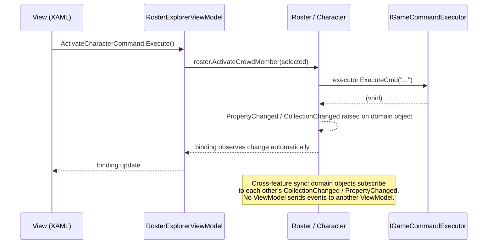

# Hero Virtual Tabletop — Architecture Reference (Skinny ViewModel extract)

> **Source:** `docs/architecture/architecture-reference.md` — Architecture Layers section and Mechanism: Skinny ViewModel only.
> Produced for `skinny-mvvm-wpf-architecture` skill, Hero Virtual Tabletop project, 2026-05-17.
> If the upstream reference is updated, re-copy these two sections here.

---

## Architecture Layers

| Layer | Tech | Location | Responsibility |
|---|---|---|---|
| **Presentation** | WPF XAML + `*ViewModel.cs`, Prism regions, `DelegateCommand`, `INotifyPropertyChanged` | `Modules/Module.HeroVirtualTabletop/{Feature}/{Feature}View.xaml` + `{Feature}ViewModel.cs` | Layout, data binding, event routing, rendering. **Nothing else.** ViewModels translate user gestures into domain calls and expose domain state for binding. They carry no business logic and hold no knowledge of game internals. |
| **Domain** | Plain C# classes and interfaces | `Modules/Module.HeroVirtualTabletop/{Feature}/` (domain files alongside views, or ideally in a sub-folder per feature) | All business rules and orchestration. `Character`, `Crowd`, `CrowdMember`, `Identity`, `AnimatedAbility`, `CharacterMovement`, `Roster`, `OptionGroup`. Domain classes hold behaviour on the entity that owns the data; they never import from `GameCommunicator` or `ProcessCommunicator` implementation assemblies. |
| **COH Integration** | `IGameCommandExecutor`, `IMemoryInstance`, `IIconInteractionUtility`; production impls `HookCostumeGameCommandExecutor`, `MemoryInstance`, `IconInteractionUtility` | `Library/GameCommunicator/`, `Library/ProcessCommunicator/` | The exclusive seam between the application and City of Heroes. Every path that reads game memory, writes a keybind file, or calls the HookCostume DLL crosses this boundary through an interface. Swap the production impl for a fake and the entire domain + presentation layer runs without COH installed. |

```
Module.HeroVirtualTabletop/{Feature}/
├── {Feature}View.xaml          ← Presentation
├── {Feature}ViewModel.cs       ← Presentation
└── {Feature}.cs                ← Domain

-- example --
Rosters/
├── RosterExplorerView.xaml     ← Presentation
├── RosterExplorerViewModel.cs  ← Presentation  (⚠ AS-IS: too fat)
└── Roster.cs                   ← Domain

Library/
├── GameCommunicator/           ← COH Integration
└── ProcessCommunicator/        ← COH Integration
```

**Dependency direction:** Presentation → Domain → COH Integration interfaces. No arrow goes the other way. A ViewModel may hold a reference to a domain object (e.g. `Character`). A domain object calls game operations only through an injected interface (e.g. `IGameCommandExecutor`). Concrete COH classes (`HookCostumeGameCommandExecutor`, `MemoryInstance`) are never referenced outside `Library/`.

---

## Mechanism: Skinny ViewModel

### Principles & Patterns

- **Principle:** A ViewModel is a binding adapter, not a controller. It translates user gestures into domain method calls and exposes domain state for XAML binding. The ViewModel knows nothing about game internals, keybinds, memory offsets, or business rules. When a structural or display concern keeps appearing across ViewModels, extract it as a named domain concept.

- **Pattern:** Delegating ViewModel with Observable Domain
  - Every command handler is a one-liner: call the domain method, done. Observable properties are direct references to domain properties — no copy, no sync.
  - **Domain extraction trigger:** When code review spots a `Dictionary` + `ObservableCollection` pair kept in sync manually, ordering logic, or any structural concern spreading across more than one ViewModel — name it in the ubiquitous language, create the domain class, delete the ViewModel plumbing. `OptionGroup` is the canonical example: each `Character` exposes `.Identities`, `.Abilities`, `.Movements` as `OptionGroup` instances; the uniqueness invariant, ordering, and `CollectionChanged` live on the domain class; ViewModels bind directly.
  - **Cross-feature state consistency** is handled in the **domain layer**, not between ViewModels. Domain objects subscribe to each other's `CollectionChanged` / `PropertyChanged`; ViewModels are passive observers.
  - **Options considered:** MVVM event aggregator (rejected — ViewModels send events to each other, domain is no longer truth, untestable in isolation); Fat ViewModel (rejected — current AS-IS for `RosterExplorerViewModel`, untestable without WPF); ViewModel helper class for extracted concerns (rejected — hides domain concept, breaks test isolation).
  - **Benefits:** No ViewModel knows another ViewModel exists. Extracted domain concepts are tested once and reused everywhere. A domain change propagates automatically through binding.
  - **Trade-offs:** Domain objects must implement `INotifyPropertyChanged` / `INotifyCollectionChanged` correctly. Recognising the extraction pattern early is cheaper than refactoring a fat ViewModel later.

### File Structure

Views, ViewModels, and domain classes are **co-located by feature folder** — separation is by file role, not by directory. Extracted domain concepts live with the entity that owns them.

```
Module.HeroVirtualTabletop/{Feature}/
├── {Feature}View.xaml          ← Presentation
├── {Feature}ViewModel.cs       ← Presentation
└── {Feature}.cs                ← Domain

-- extraction example --
Characters/
├── OptionGroup.cs              ← Domain: extracted from ViewModel plumbing
└── Character.cs                ← Domain: exposes .Identities/.Abilities/.Movements as OptionGroup
```

### Participants

Every ViewModel has four explicit relationship types with its domain. The pattern is shown once using `RosterExplorerViewModel` as the worked example — apply the same shape to every other feature ViewModel.

**1. Command → Domain Method**

| ViewModel command | Handler (one-liner) | Domain method |
|---|---|---|
| `SpawnCommand` | `_roster.SpawnCrowdMember(SelectedCharacter)` | `Roster.SpawnCrowdMember(ICrowdMember)` |
| `ActivateCharacterCommand` | `_roster.ActivateCrowdMember(SelectedCharacter)` | `Roster.ActivateCrowdMember(ICrowdMember)` |
| `ClearFromDesktopCommand` | `_roster.ClearFromDesktop(SelectedCharacter)` | `Roster.ClearFromDesktop(ICrowdMember)` |
| `{AnyOtherCommand}` | `_{domainObject}.{DomainMethod}({selectedItem})` | `{DomainClass}.{DomainMethod}({param})` |

**2. Bound Property → Domain Source**

| ViewModel property | Domain source | Change notification |
|---|---|---|
| `Participants` | `Roster.Members` — direct reference, not a copy | `Roster.Members CollectionChanged` |
| `SelectedCharacter` | resolved `Character` in `Roster.Members` | ViewModel setter |
| `ActiveCharacter` | `Roster.Members.First(m => m.IsActive)` | `Character.IsActive PropertyChanged` |
| `{AnyDisplayProperty}` | `{DomainObject}.{DomainProperty}` — direct, no copy | `{DomainObject}.PropertyChanged` |

**3. Domain → Domain Observable Subscription** (cross-feature consistency, no ViewModel involved)

| Event | Subscriber | Effect |
|---|---|---|
| `Crowd.Members CollectionChanged` | `Roster` | Removes the member from `Roster.Members` — `RosterExplorerViewModel` sees it via binding |
| `{DomainObject}.{Event}` | `{OtherDomainObject}` | Keeps `{OtherDomainObject}` consistent — ViewModels observe the result automatically |

**4. Domain Field → View Display / Edit** *(worked example: `RosterExplorerView`)*

| What the user sees / edits | XAML binding | Domain field | R/W |
|---|---|---|---|
| Roster entry list | `ItemsSource="{Binding Participants}"` | `Roster.Members` | R |
| Character name | `Text="{Binding Name}"` | `Character.Name` | R |
| Active turn indicator | icon visibility | `Character.IsActive` | R |
| Spawned state | icon visibility | `Character.IsSpawned` | R |
| Selected character | `SelectedItem="{Binding SelectedCharacter}"` | resolved `Character` | R+W |
| Maneuvering-with-camera | toggle state | `Character.IsManeuveringWithCamera` | R+W |
| Distance counter | `Text="{Binding DistanceCount}"` | `Character.DistanceCount` | R |
| *For any other view:* | `{Binding {VMProperty}}`  | `{DomainObject}.{Field}` | R or R+W |

```mermaid
classDiagram
    class RosterExplorerViewModel {
        -_roster: IRoster
        +Participants: ObservableCollection~ICrowdMember~
        +SelectedCharacter: ICrowdMember
        +ActiveCharacter: ICrowdMember
        +SpawnCommand → Roster.SpawnCrowdMember()
        +ActivateCharacterCommand → Roster.ActivateCrowdMember()
        +ClearFromDesktopCommand → Roster.ClearFromDesktop()
    }
    class Roster {
        +Members: ObservableCollection~ICrowdMember~
        +SpawnCrowdMember(cm)
        +ActivateCrowdMember(cm)
        +ClearFromDesktop(cm)
    }
    class Character {
        +Name: string
        +IsActive: bool
        +IsSpawned: bool
        +IsManeuveringWithCamera: bool
        +DistanceCount: float
    }
    class Crowd {
        +Members: ObservableCollection~ICrowdMember~
        +IsGangMode: bool
    }
    RosterExplorerViewModel --> Roster : delegates commands\nbinds Participants ← Roster.Members
    Roster --> Character : members implement ICrowdMember
    Roster ..> Crowd : subscribes CollectionChanged\n(domain-to-domain; no VM involved)
```

### Flow



### Walkthrough Example

**Scenario A: GM activates a character (command delegation).**

1. `RosterExplorerView.xaml` has `Command="{Binding ActivateCharacterCommand}"` on the menu item.
2. `RosterExplorerViewModel.ActivateCharacterCommand.Execute()` fires. The handler: `_roster.ActivateCrowdMember(SelectedCharacter)` — one line.
3. `Roster.ActivateCrowdMember()` sets the active flag, resolves gang-mode, calls game commands through injected `IGameCommandExecutor`.
4. `Character.IsActive` raises `PropertyChanged`; active indicator in XAML updates automatically.

```csharp
public class RosterExplorerViewModel : BindableBase
{
    private readonly IRoster _roster;

    public RosterExplorerViewModel(IRoster roster)
    {
        _roster = roster;
        ActivateCharacterCommand = new DelegateCommand(ActivateSelectedCharacter, CanActivate);
    }

    public ICrowdMember? SelectedCharacter { get; set; }
    public DelegateCommand ActivateCharacterCommand { get; }

    private void ActivateSelectedCharacter() =>
        _roster.ActivateCrowdMember(SelectedCharacter!);

    private bool CanActivate() => SelectedCharacter != null;
}
```

**Scenario B: ViewModel concern extracted to domain (OptionGroup).**

When a ViewModel is managing ordered, keyed options in parallel collections — stop. Name the concept, create the domain class, delete the ViewModel plumbing.

1. Before: `IdentityEditorViewModel` held a `Dictionary<string, Identity>` and an `ObservableCollection<Identity>` kept in sync manually, with ordering logic in the ViewModel.
2. After: `OptionGroup` owns uniqueness enforcement, ordering, and `CollectionChanged`. `Character` exposes `.Identities` as an `OptionGroup`. The ViewModel shrinks to a pass-through.

```csharp
public class IdentityEditorViewModel : BindableBase
{
    private readonly Character _character;
    public OptionGroup Identities => _character.Identities;  // direct — no copy
    public DelegateCommand<IIdentity> AddIdentityCommand { get; }

    public IdentityEditorViewModel(Character character)
    {
        _character = character;
        AddIdentityCommand = new DelegateCommand<IIdentity>(
            id => _character.Identities.Add(id));
    }
}
```

> See **Testing Architecture** in the full reference for tests verifying command delegation and the `OptionGroup` uniqueness invariant.

### Testing the Mechanism

**Domain tier** — test domain invariants (e.g. `OptionGroup` uniqueness) with plain domain objects and no stubs at all. Test ViewModel delegation with `Mock<IRoster>` or similar; assert the command calls the domain method exactly once.

**ViewModel + Domain tier** — wire the real domain with `FakeMemoryInstance` / `NoOpGameCommandExecutor`; assert both binding state and domain post-state.

**Game Bridge tier** — not applicable here. Skinny ViewModel tests never require COH; the game boundary is owned by the COH Bridge mechanisms.

See **Testing Architecture** in the full reference for worked examples and the `[AssemblyInitialize]` setup that installs stubs for the whole test run.
