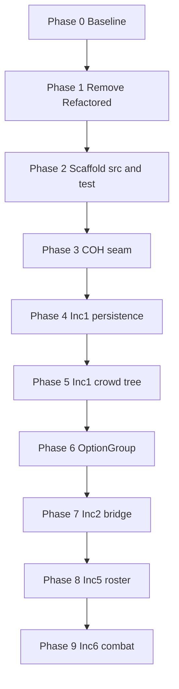

# Hero VTT Refactoring Plan

**Status:** Research / planning — no production refactor started yet  
**Date:** 2026-05-22  
**Scope:** Move `HeroVirtualTabletop.WPF` toward `abd-clean-code`, `hero-vtt-technical-architecture`, and increment object models — test-first from spec-by-example.

---

## 1. Executive summary

The WPF app has strong **spec-by-example** and **E2E** investment, but production code has not caught up:

- **Fat ViewModels** (`RosterExplorerViewModel` **3,701** LOC, `CharacterExplorerViewModel` **2,660**, `AbilityEditorViewModel` **2,040**) hold business logic that belongs in domain classes.
- **181** `Helper.Global*` references and **20** `new MemoryElement()` sites violate explicit-dependencies / COH seam rules (see §6.1).
- **No clean domain layer** for roster, crowd tree, combat, etc.
- **COH integration leaks** via static `GameCommandExecution`, direct `new MemoryElement()`, and imports outside `Library/Integration`.
- **Legacy test project** (`Module.UnitTest`) uses old technical folders — **do not migrate**; rewrite from SBE.

**Approach:** Incremental module relocation. **Tier 1 (domain) and Tier 2 (ViewModel binding) tests from SBE first** — all must **run and pass** against the existing code before any file is moved. Then **copy** existing working modules as-is into `src/{Domain}/` — no rewrite, no behaviour change. Original files in `Module.HeroVirtualTabletop` are **never touched**. Tests prove the copy is correct. **No big-bang rewrite.**

**Hard gate (locked):** Do **not** copy any file to `src/` until Tier 1 + Tier 2 suites for that module follow `abd-acceptance-test-driven-development` and `abd-clean-code`, and **`dotnet test` is green**. Copy = duplicate existing file into `src/` + update namespace + fix references. Original untouched. Green tests before copy; green tests after copy.

---

## 2. Decisions (locked)

| Topic | Decision |
|-------|----------|
| **CrowdTree vs CrowdRepository** | CrowdTree is the display/orchestration surface; it **calls** CrowdRepository for registry and persistence. VM binds to CrowdTree with one-liner commands. |
| **Refactored/ folder** | For a **separate new app** — remove from this repo: `HeroVirtualTabletop.dll`, migrate code, `btMigrate` button, `extern alias HVTRefactored`. |
| **OptionGroup** | Abstract base + `IdentityOptionGroup`, `AbilityOptionGroup`, `MovementOptionGroup` — implement per object model; no approval gate. |
| **Old unit tests** | **Retire `Module.UnitTest`** — do not map or move. New tests written **from scratch** from SBE + story map (ATDD). |
| **Test source of truth** | `docs/increment-N/specification-by-example-*.md` + story map sub-epic names (same as E2E). |
| **Test foundation gate** | Tier 1 + Tier 2 complete, ATDD-compliant, **all green** — **before** any production refactor line. |
| **`tests/domain/`** | **Empty today (0 files).** Tier 1+2 tests go here, mirroring `tests/e2e/` folder names — not in `Module.UnitTest`. |
| **Composition root** | `HeroVirtualTabletopModule.RegisterViewsAndRepositories()` — extend Unity registration to wire domain services + COH interfaces, not just View/ViewModel pairs. |

---

## 3. Target architecture

### 3.1 Layers

```
Presentation (View + ViewModel)     ← one-liner commands, direct domain bindings
        ↓
Domain (entities, aggregates)       ← plain C#, constructor-injected seams
        ↓
Integration (COH only)              ← IGameCommandExecutor, IMemoryInstance, IIconInteractionUtility
```

**Rules:**

- ViewModel command handlers ≤ 3 lines; delegate to domain.
- No concrete COH types in domain or ViewModels.
- No static `GameCommandExecution` at new call sites.
- Cross-feature sync via domain observables — not Prism EventAggregator for state.

### 3.2 Mechanisms (hero-vtt-technical-architecture)

| Mechanism | Outcome |
|-----------|---------|
| **Skinny ViewModel** | Commands delegate; properties bind directly to domain |
| **COH Game Bridge Seam** | All COH concrete types in `src/Integration/` only |
| **Direct Memory Manipulation** | Offsets only in `MemoryInstance`; domain uses semantic `IMemoryInstance` |
| **OptionGroup** | Typed subclasses with selection/active invariants in domain |

---

## 4. Repository layout

### 4.1 Production — `src/` by domain

Organize by **domain aggregate**, not by layer. Co-locate domain class + ViewModel + View in the same domain folder.

```
src/
  Shell/                              ← app entry, module bootstrap
  Integration/
    GameCommunicator/                 ← IGameCommandExecutor, HookCostumeGameCommandExecutor
    ProcessCommunicator/              ← IMemoryInstance, MemoryInstance
    Utility/                          ← IconInteractionUtility, DllInjector (no business rules)

  ApplicationShell/
  Crowds/
    CrowdTree.cs
    CrowdRepository.cs
    Crowd.cs
    CrowdMember.cs
    Clipboard.cs
    CharacterExplorerViewModel.cs
    CharacterExplorerView.xaml
  Character/
    Character.cs
    CharacterEditorViewModel.cs
    CharacterEditorView.xaml
  OptionGroups/
    OptionGroup.cs                    ← abstract base
  Identities/
    IdentityOptionGroup.cs
    Identity.cs
    ...
  AnimatedAbilities/
    AbilityOptionGroup.cs
    AnimatedAbility.cs
    ...
  Movements/
    MovementOptionGroup.cs
    CharacterMovement.cs
    MovementExecution.cs
    ...
  Roster/
    Roster.cs
    RosterEntry.cs
    ActiveCharacter.cs
    GangMode.cs
    RosterExplorerViewModel.cs
    RosterExplorerView.xaml
  Desktop/
  Combat/
  CrowdMove/
  HCSIntegration/
  CameraRig/
  GameBridge/
```

**Note:** `src/` domain names (Crowds, Roster) intentionally differ from test sub-epic names (manage_crowd_repository, roster) — see §5.

### 4.2 Tests — three tiers, story-map folders (from scratch)

**Do not migrate `Module.UnitTest/`.** Write every Tier 1 and Tier 2 test from SBE scenarios.

#### 4.2.1 Current reality (2026-05-22)

| Location | Files | Status |
|----------|------:|--------|
| **`tests/domain/`** | **0** | Folder exists; **never populated** — this is where Tier 1+2 must go. |
| **`tests/e2e/`** | ~173 `[TestClass]` files, 28 sub-epic folders | Story-map aligned; **builds green**; full test run **not completed** (`tests/e2e/RESUME-STATUS.md`). |
| **`Module.UnitTest/`** | **117** `[TestClass]` in technical folders (`Crowds/`, `Roster/`, `CrowdOrchestration/`, …) | Mixed Tier 1+2; wrong layout; **retire**, do not copy. |

If you expected domain tests under `tests/domain/` — they were planned but **not written there**. Legacy coverage lives only in `Module.UnitTest/` until replaced.

#### 4.2.2 Tier definitions

| Tier | Folder | What it tests | Calls |
|------|--------|---------------|-------|
| **1 — Domain** | `tests/domain/{sub_epic}/...` | Domain entities, aggregates, invariants from SBE | Production domain API + `tests/domain/Support/` fakes |
| **2 — Presentation binding** | Same story folder (separate class or file) | Thin ViewModel binds to domain; command one-liners | Real ViewModel + faked seams |
| **3 — E2E** | `tests/e2e/{sub_epic}/...` | Full app + game surface (FlaUI / AppDriver) | UI automation |

Tier 1 and Tier 2 share the **same sub-epic / story / scenario folder tree** as E2E. Only the helper base and assertions differ.

#### 4.2.3 Target layout

```
tests/
  domain/                                 ← Tier 1 + 2 (EMPTY — populate from SBE)
    Support/
      FakeMemoryInstance.cs
      NoOpGameCommandExecutor.cs
      GameCommandTestAssemblyHooks.cs

    manage_crowd_repository/
      ManageCrowdRepositoryHelper.cs      ← sub-epic helpers only
      load_active_crowd_files_on_startup/
        LoadActiveCrowdFilesOnStartup.cs  ← [TestClass] = story name (Tier 1)
        LoadActiveCrowdFilesOnStartupViewModel.cs   ← optional Tier 2
      browse_and_activate_crowd_files/
        BrowseAndActivateCrowdFiles.cs
      ...

    roster/
      RosterHelper.cs
      spawn_character_to_desktop_from_roster/
        SpawnCharacterToDesktopFromRoster.cs
      ...

  e2e/                                    ← Tier 3 (exists today)
    manage_crowd_repository/
      ManageCrowdRepositoryHelper.cs
      load_active_crowd_files_on_startup/
        LoadActiveCrowdFilesOnStartup.cs  ← same class + method names as domain tier
    Support/
      AppDriver.cs
```

**Future:** When production moves to flat `src/`, domain test project can stay under `tests/domain/` (no rename required).

### 4.3 ATDD structure rules (Tier 1, 2, and 3)

Before writing any test file, declare:

```
Story path:  [Sub-Epic] → [Story] → [Scenario]
Folder:      tests/{domain|e2e}/{sub_epic}/{story_snake}/
File:        {StoryPascal}.cs              ← one story per file (C# convention)
Class:       {StoryPascal}                  ← exact story name from SBE ([TestClass])
Method:      {ScenarioOutcomePascalCase}    ← exact scenario title from SBE ([TestMethod])
Helper:      {SubEpic}Helper.cs at sub-epic root; Given*/When*/Then* methods
```

**Mapping to `abd-acceptance-test-driven-development`:**

| ATDD skill (generic) | Hero VTT / C# (this repo) |
|------------------------|---------------------------|
| Navigate epics → lowest sub-epic → **file** named after grouping | Sub-epic folder + **one file per story** (story subfolder) |
| **Class** = story | **Class** = story — matches |
| **Method** = scenario | **Method** = scenario — matches |
| `given_*` / `when_*` / `then_*` helpers | Same; often on `{SubEpic}Helper` base class |
| Epic-level `{epic}_helper.py` | Sub-epic `{SubEpic}Helper.cs` (shared across stories in sub-epic) |

When a sub-epic has **multiple stories**, the skill’s Python template puts all story classes in one `{lowest_sub_epic}.py` file. **This repo uses one `.cs` file per story** instead — still correct: class = story, method = scenario. The common mistake to avoid is naming the **file** after a single scenario or abbreviating the **class** name.

**Per test method:** orchestrator pattern — `# Given` / `# When` / `# Then` comments; call helpers (under 20 lines per method). Production code under test must follow `abd-clean-code` (explicit dependencies, domain language, functions under 20 lines) as tests drive the API.

**Workflow per story (increment in scope):**

1. Read SBE scenario in `docs/increment-N/`.
2. Declare structure (path, file, class, method) — **before code**.
3. Write Tier 1 domain test in `tests/domain/...` — call real production types; use fakes at COH boundary only.
4. Run — tests must compile and run (RED acceptable if target API not implemented yet; **gate for refactor** requires green against agreed surface).
5. Optional Tier 2 ViewModel binding in same story folder.
6. Tier 3 E2E under `tests/e2e/...` — same class and method names; helpers drive UI.
7. **Only when Tier 1+2 green:** refactor production (extract domain, slim VM).
8. Ignore legacy `Module.UnitTest` until deleted.

### 4.4 E2E suite vs ATDD scanners

**Structure audit (2026-05-22):** `tests/e2e/` **does** follow the story map:

- **28 sub-epic folders** (e.g. `manage_crowd_repository`, `roster`, `attack_configuration`) — names match story-map sub-epics.
- **~173 test classes** — one `[TestClass]` per story file; class name = story (PascalCase of story title).
- **Test methods** — one per scenario; names match SBE scenario outcomes.
- **Helpers** — `{SubEpic}Helper.cs` at sub-epic root; test classes inherit and use `Given*` / `When*` / `Then*` (orchestrator pattern).

Example (Tier 3):

```csharp
// tests/e2e/manage_crowd_repository/load_active_crowd_files_on_startup/LoadActiveCrowdFilesOnStartup.cs
[TestClass]
public class LoadActiveCrowdFilesOnStartup : ManageCrowdRepositoryHelper
{
    [TestMethod]
    public void EmptyActiveCrowdListLoadsNoCrowdsAndNoDefaults()
    {
        GivenActiveCrowdListIsEmpty();
        WhenCharacterCrowdMainWorkspaceOpens();
        ThenCrowdTreeIsEmpty();
        ThenNoCrowdLoadErrorsOccurred();
    }
}
```

**Scanners:** `abd-acceptance-test-driven-development` ships **Python and JavaScript scanners only** — there is **no C# scanner**. E2E was **not** machine-scanned. Compliance is **manual / AI review** against skill rules (orchestrator, domain language, mock boundaries, no guard clauses in tests, etc.).

**E2E run status:** Project builds with zero errors (`CrowdManagement.E2ETests.csproj`). Full pass/fail counts **not yet recorded** — see `tests/e2e/RESUME-STATUS.md`. Phase 0 must complete the first full run.

**Action:** When adding domain tests, **copy class and method names from the matching E2E file** so all three tiers stay traceable to the same SBE scenario.

### 4.5 Test foundation gate (non-negotiable)

**No production refactor until Tier 1 + Tier 2 are working.**

| Requirement | Detail |
|-------------|--------|
| **Location** | `tests/domain/{sub_epic}/...` populated for increment in scope |
| **Source** | SBE scenarios — not copied from `Module.UnitTest/` |
| **Skills** | `abd-acceptance-test-driven-development` (structure, orchestrator, domain language) + `abd-clean-code` (API under test) |
| **Run** | `dotnet test` on domain test project — **all tests pass** |
| **Blocked until green** | Extract domain to `src/`, slim ViewModels, delete logic from fat VMs, COH seam moves, OptionGroup refactors |

Allowed **before** gate: writing tests, test Support fakes, test csproj/scaffold, documentation, running baseline reports. **Phase 1 (Refactored/ cleanup)** is optional early cleanup — treat as exception only if it does not touch behavior under active SBE stories; prefer **tests first**.

**First increment (recommended):** `manage_crowd_repository` — SBE in `docs/increment-1/`, E2E already exists; domain tests are the gap.

### 4.6 Example domain test (target shape)

Tier 1 calls domain directly (not AppDriver). Same class and method names as E2E.

```csharp
// tests/domain/manage_crowd_repository/load_active_crowd_files_on_startup/LoadActiveCrowdFilesOnStartup.cs
[TestClass]
public class LoadActiveCrowdFilesOnStartup : ManageCrowdRepositoryHelper
{
    // Scenario: An empty Active Crowd List loads no Crowds and no defaults
    [TestMethod]
    public void EmptyActiveCrowdListLoadsNoCrowdsAndNoDefaults()
    {
        // Given: the Active Crowd List is empty
        GivenActiveCrowdListIsEmpty();

        // When: Crowd Tree loads active files on open
        WhenCrowdTreeLoadsActiveFilesOnOpen();

        // Then: no crowds are registered
        ThenCrowdRepositoryHasNoCrowds();
        ThenNoCrowdLoadErrorsOccurred();
    }
}
```

E2E uses the **same class and method names**; helpers drive UI instead of domain.

---

## 5. src vs test naming

| | Organized by | Example |
|--|--------------|---------|
| **`src/`** | Domain aggregate (object model) | `src/Crowds/CrowdTree.cs` |
| **`tests/domain/`** | Story-map sub-epic (Tier 1+2) | `tests/domain/manage_crowd_repository/...` |
| **`tests/e2e/`** | Story-map sub-epic (Tier 3) | `tests/e2e/manage_crowd_repository/...` |

This is intentional. Production groups by **what things are**. Tests group by **what behavior the spec describes**.

---

## 6. Current state (baseline)

**Measurement scope:** `HerovirtualTableTop/.../Module.HeroVirtualTabletop/` — excludes `Refactored/`, `* - Copy.cs`, `Class1.cs`, `obj/`.  
**Scan date:** 2026-05-22. Re-run the counts before each phase; numbers below are the baseline to beat.

### 6.1 Biggest clean-code violations (measured)

| # | Violation | Rule | Baseline count | Target | Top offenders |
|---|-----------|------|---------------:|--------|---------------|
| 1 | **God ViewModels** (> 300 LOC; hero-vtt target ≤ 300) | Single responsibility · Skinny ViewModel | **11 files** over limit; worst **3,701** LOC | ≤ 300 LOC per VM (or documented exception) | `RosterExplorerViewModel.cs` (3,701), `CharacterExplorerViewModel.cs` (2,660), `AbilityEditorViewModel.cs` (2,040) |
| 2 | **God domain / integration types** (> 300 LOC) | Single responsibility | **4 files**; worst **2,834** LOC | Split by aggregate / mechanism | `Movement.cs` (2,834), `AnimatedAbility.cs` (1,961), `Character.cs` (1,638), `HCSIntegrator.cs` (1,542) |
| 3 | **`Helper.Global*` static access** | Explicit dependencies · no hidden globals | **181** references in **20** files | **0** new; drive to **0** | `AbilityEditorViewModel.cs` (46), `RosterExplorerViewModel.cs` (24), `CharacterCrowdMainViewModel.cs` (20) |
| 4 | **Static `GameCommandExecution` usage** | COH Game Bridge seam | **11** call sites (**12** mentions incl. type/def) | **0** outside `Library/GameCommunicator/` | `AnimatedElement.cs` (7), `RosterExplorerViewModel.cs` (2) |
| 5 | **`new MemoryElement()` in domain/VM** | Integration boundary | **20** construction sites | **0** outside Integration; inject `IMemoryInstance` | `Character.cs` (9), `RosterExplorerViewModel.cs` (7), `CrowdMember.cs` (3) |
| 6 | **`MemoryElement` / `ProcessCommunicator` refs outside `Library/`** | COH seam | **45** / **10** file-line hits | **0** outside `Library/Integration` | `Character.cs`, `Movement.cs`, roster/crowd VMs |
| 7 | **Broad `catch (Exception`** | Never swallow; domain exceptions | **24** catch blocks | Convert/rethrow; no silent paths | `HCSIntegrator.cs` (5), `CharacterExplorerViewModel.cs` (4) |
| 8 | **Empty catch blocks** | Never swallow | **8** | **0** | (scan: `catch { }` / `catch () { }`) |
| 9 | **Public fields on ViewModels** (heuristic) | Encapsulation | **8** | **0**; use properties | — |
| 10 | **Missing domain aggregates** | Domain language | **`Roster`** type absent; logic on `RosterExplorerViewModel` | Typed `Roster`, `RosterEntry`, `ActiveCharacter`, `GangMode` in domain | — |
| 11 | **Wrong composition** | Object model | **`CrowdMember : Character`** (inheritance) | Compose `Character` inside `CrowdMember` | `CrowdMember.cs` |
| 12 | **Dead duplicate sources** | DRY · delete noise | **3,603** LOC in 2 files (delete candidates) | **0** | `Class1.cs` (1,899), `RosterExplorerViewModel - Copy.cs` (1,704) |

**ViewModels over 300 LOC (full list):**

| LOC | File |
|----:|------|
| 3,701 | `Rosters/RosterExplorerViewModel.cs` |
| 2,660 | `Crowds/CharacterExplorerViewModel.cs` |
| 2,040 | `AnimatedAbilities/AbilityEditorViewModel.cs` |
| 973 | `OptionGroups/OptionGroupViewModel.cs` |
| 717 | `Movements/MovementEditorViewModel.cs` |
| 519 | `AnimatedAbilities/ActiveAttackViewModel.cs` |
| 469 | `Library/HeroVirtualTabletopMainViewModel.cs` |
| 434 | `Characters/CharacterEditorViewModel.cs` |
| 394 | `Identities/IdentityEditorViewModel.cs` |
| 315 | `Crowds/CharacterCrowdMainViewModel.cs` |
| 311 | `Crowds/CrowdFromModelsViewModel.cs` |

**Test debt (related baseline):**

| Item | Count |
|------|------:|
| `tests/domain/` test files | **0** |
| `Module.UnitTest/` `[TestClass]` fixtures | **117** (retire; wrong layout) |
| `tests/e2e/` `[TestClass]` files | **~173** |
| Production `.cs` files in module (excl. dead copies) | **93** |

**Re-scan (PowerShell)** — run from repo root to refresh baseline:

```powershell
$root = "HerovirtualTableTop\HeroVirtualTabletop.WPF\Modules\Module.HeroVirtualTabletop"
$prod = Get-ChildItem $root -Recurse -Include *.cs -File |
  Where-Object { $_.FullName -notmatch '\\obj\\|\\Refactored\\| - Copy\.cs$|\\Class1\.cs$|_wpftmp' }
function Count($pat) {
  ($prod | Select-String -Pattern $pat -AllMatches |
    ForEach-Object { $_.Matches.Count } | Measure-Object -Sum).Sum
}
[ordered]@{
  Helper_Global = Count 'Helper\.Global'
  GameCommandExecution = Count 'GameCommandExecution'
  new_MemoryElement = Count 'new MemoryElement\('
  catch_Exception = Count 'catch\s*\(\s*Exception'
  VMs_over_300 = (
    Get-ChildItem $root -Recurse -Filter '*ViewModel.cs' |
      Where-Object { $_.FullName -notmatch 'Refactored| - Copy' } |
      ForEach-Object { (Get-Content $_ | Measure-Object -Line).Lines } |
      Where-Object { $_ -gt 300 } | Measure-Object
  ).Count
} | Format-Table -AutoSize
```

### 6.2 Fat ViewModels (priority debt)

Same as §6.1 row #1 — kept here for phase ordering. Worst four:

| ViewModel | LOC | Debt |
|-----------|----:|------|
| `RosterExplorerViewModel` | 3,701 | Roster, desktop, combat, HCS, crowd move |
| `CharacterExplorerViewModel` | 2,660 | Crowd tree, clipboard, load/save, filter |
| `AbilityEditorViewModel` | 2,040 | Ability editing orchestration |
| `OptionGroupViewModel` | 973 | Selection semantics (partially extracted) |

Also remove: duplicate `RosterExplorerViewModel - Copy.cs` (1,704 LOC), `Rosters/Class1.cs` (1,899 LOC).

### 6.3 Architecture violations (summary)

See **§6.1** for counts. Qualitative gaps:

- Missing `Roster` domain aggregate (logic trapped in 3,701-line VM).
- COH/memory leaks outside `Library/` (see rows #4–6).
- `CrowdMember : Character` vs compose-in-model.
- `Module.UnitTest` mixed tiers (**117** classes); `tests/domain/` **empty**.
- No dedicated Game Bridge integration test project.

### 6.4 Object model inputs

| Increment | Docs | Code gap |
|-----------|------|----------|
| 1 | `object-model-increment-1.md` + SBE | CrowdTree/Repository logic in VM |
| 2–6 | CRC + SBE (no typed OM yet) | Logic on `Character` god-object and roster VM |

Resolve CRC doc duplicates before large extractions: **F2** (Tree vs Repository wording — behavior is Tree orchestrates, Repository persists), **F4** (OptionGroup base — implement).

### 6.5 Validation tooling

- `abd-clean-code` has **no C# scanners** — manual rules pass only.
- `abd-acceptance-test-driven-development` has **Python/JS scanners only** — C# domain and E2E tests require **manual / AI rules pass** (orchestrator, story=class, scenario=method, mock boundaries).
- Consider adding hero-vtt architecture scanners later (VM line count, COH import ban).

---

## 7. Phased roadmap

### Phase 0 — Test foundation + baseline (M) **← start here**

**Goal:** Tier 1 + Tier 2 green for first increment; E2E baseline recorded. **No production refactor.**

1. **E2E baseline** — Run full suite per `tests/e2e/RESUME-STATUS.md`; record pass/fail counts.
2. **Scaffold `tests/domain/`** — `CrowdManagement.DomainTests.csproj` (or equivalent), `Support/` fakes, first sub-epic `manage_crowd_repository/`.
3. **Write Tier 1 tests from SBE** — every scenario in increment-1 crowd persistence stories; ATDD structure; declare file/class/method before coding.
4. **Write Tier 2 tests** — ViewModel binding for same stories where SBE covers UI commands.
5. **AI rules pass** — Review against `abd-acceptance-test-driven-development` + `abd-clean-code` (no C# scanners).
6. **`dotnet test`** — domain project **all green** (may require minimal prod fixes only if tests expose compile breaks — not refactors).
7. **Baseline report** — re-run §6.1 PowerShell scan; record VM LOC and violation counts.

**DoD:** `tests/domain/manage_crowd_repository/` complete; Tier 1+2 green; E2E pass/fail documented; **gate satisfied for Increment 1 crowd persistence**.

### Phase 1 — Cleanup dead experiments (S) — after Phase 0 gate or parallel if zero SBE impact

- Remove `Refactored/` references: migrate code, `btMigrate`, `HVTRefactored` alias, unused `Caliburn.Micro` ref in module csproj.
- Delete duplicate Copy VMs and `Class1.cs` when safe.
- **DoD:** Builds clean; no behavior change for normal GM workflows; Tier 1+2 still green.

### Phase 2 — Scaffold `src/` layout (S) — **only after Phase 0 gate for that increment**

- Create `src/` domain folders (move types incrementally, not big-bang).
- Wire domain test project to new namespaces when types move.
- **DoD:** One increment wired in new layout; Tier 1+2 still green.

### Phase 3 — COH seam hardening (M)

- Assembly-level `FakeMemoryInstance` + `NoOpGameCommandExecutor`.
- Constructor injection on new/changed domain paths.
- Ban new static `GameCommandExecution` usages.
- Create `tests/domain/integration/` (or separate csproj) for Game Bridge tests.
- **DoD:** Fakes wired; no new static executor call sites.

### Phase 4 — Increment 1: Crowd persistence (L)

**Stories (from SBE):** Load Active Crowd Files on Startup, Browse and Activate, Save Dirty, Save to New File, Daily Backup.

- Write domain tests from SBE under `tests/domain/manage_crowd_repository/...` — must already be **green** from Phase 0 before extraction.
- Implement `CrowdTree` + `CrowdRepository` in `src/Crowds/`.
- Slim `CharacterExplorerViewModel` save/browse to one-liners.
- **DoD:** Inc 1 persistence domain tests green; E2E `manage_crowd_repository/*` green.

### Phase 5 — Increment 1: Character & crowd tree (L)

**Stories:** add/rename/clone/link/nest/filter, clipboard, All Characters crowd.

- Domain tests from SBE — RED first.
- Fix `CrowdMember` composition; move invariants off VM.
- **DoD:** Crowd tree CRUD in domain; VM interim < 1,500 lines.

### Phase 6 — OptionGroup pattern (M)

- `OptionGroup` abstract base + three typed subclasses in `src/OptionGroups/` and domain folders.
- Domain tests from identity/ability/movement SBE.
- Slim `OptionGroupViewModel` < 200 lines.

### Phase 7 — Increment 2: Game bridge & identity (M)

- `GameBridge` facade; extract spawn/ghost from `Character`.
- Domain tests from `game_bridge_initialization`, `identity_management` SBE.

### Phase 8 — Increment 5: Roster & desktop (L)

- `Roster`, `RosterEntry`, `ActiveCharacter`, `GangMode` in `src/Roster/`.
- Domain tests from `tests/domain/roster/`, `tests/domain/desktop_overlay/`, `tests/domain/context_menu/` SBE.
- Replace EventAggregator roster sync with domain subscriptions.

### Phase 9 — Increment 6: Combat & orchestration (L)

- Extract `CombatExecution`, `CrowdMove`, `CombatGeometry`; split `HCSIntegrator`.
- Domain tests from combat/crowd_move/hcs SBE sub-epics.
- **DoD:** `RosterExplorerViewModel` < 300 lines or split into domain-bound feature VMs.



**Parallelization:** Phase 1 + 2 can overlap Phase 0. Phase 6 after Phase 5 Character entity exists.

---

## 8. Composition root (plain language)

**Composition root** = where the app **wires objects together at startup**.

When the UI needs a `CharacterExplorerViewModel`, something must supply a `CrowdTree`, `CrowdRepository`, and COH fakes/reals. That wiring lives in:

`HeroVirtualTabletopModule.RegisterViewsAndRepositories()`

Today it only registers View + ViewModel. After refactor it also registers:

- `IGameCommandExecutor` → real or `NoOp` (tests)
- `IMemoryInstance` → real or `FakeMemoryInstance` (tests)
- `CrowdRepository`, `CrowdTree`, `Roster`, etc.

No new concept — **extend the existing Unity module registration**.

---

## 9. Do not do

| Anti-pattern | Why |
|--------------|-----|
| Big-bang rewrite of god ViewModels | Unmergeable PRs; E2E blackout |
| Migrate `Module.UnitTest` files | Wrong structure; write from SBE instead |
| Split VMs that talk via EventAggregator | Recreates fat-VM problem |
| Rename E2E story folders | Breaks traceability |
| Delete failing E2E to “fix” refactor | Fix production or AppDriver |
| Extract domain before COH injection | Domain will still call COH directly |
| Keep `HVTRefactored` / `Refactored/` | Separate new app; not this codebase |
| Gate CI on live Game Bridge tests | Requires COH install |

---

## 10. Success criteria

### Program complete

Measurable vs §6.1 baseline (2026-05-22):

| Metric | Baseline | Target |
|--------|----------:|-------:|
| ViewModels > 300 LOC | 11 | 0 (or documented exceptions) |
| `Helper.Global*` references | 181 | 0 |
| `GameCommandExecution` call sites outside `Library/` | 11 | 0 |
| `new MemoryElement()` outside Integration | 20 | 0 |
| `catch (Exception` blocks (unconverted) | 24 | 0 |
| Empty catch blocks | 8 | 0 |
| Dead duplicate LOC (`Class1`, `Copy`) | 3,603 | 0 (files deleted) |

Also:

- Domain tests cover every SBE story per increment (from `tests/domain/`).
- Tier 1 + Tier 2 **green before** each increment’s production refactor.
- E2E suite green under `tests/e2e/`.
- `Module.UnitTest` deleted (**117** classes retired).
- `Refactored/` removed.

### Per-phase

- Re-run §6.1 scan; counts must not regress on untouched metrics.

- Domain tests for extracted behavior: RED → GREEN.
- Affected E2E subset green.
- Measurable VM LOC reduction in target file.

---

## 11. Per-PR checklist

- [ ] Tier 1 + Tier 2 green in `tests/domain/` for stories in scope (**gate**)
- [ ] SBE scenarios identified for behavior in scope
- [ ] ATDD structure declared (folder, file, class, method) before writing tests
- [ ] Domain tests call production code directly; mocks only at COH boundary
- [ ] No new concrete COH imports in domain/VM
- [ ] VM command handlers ≤ 3 lines for touched commands
- [ ] E2E subset run green
- [ ] Legacy `Module.UnitTest` untouched (until story fully replaced)

---

## 12. References

| Artifact | Path |
|----------|------|
| Architecture reference | `.cursor/skills/hero-vtt-technical-architecture/inputs/architecture-reference.md` |
| Increment 1 object model | `docs/increment-1/object-model-increment-1.md` |
| Increment 1 SBE | `docs/increment-1/specification-by-example-increment-1.md` |
| CRC cross-review | `docs/cross-increment-crc-review.md` |
| E2E tests (Tier 3) | `tests/e2e/` |
| Domain tests (Tier 1+2) — **empty, target** | `tests/domain/` |
| E2E resume status | `tests/e2e/RESUME-STATUS.md` |
| Legacy unit tests (retire) | `HerovirtualTableTop/.../Module.UnitTest/` |
| Skinny MVVM example | `Module.UnitTest/ArchitectureExample/SkinnyViewModelExample.cs` |
| ATDD skill | `.cursor/skills/abd-acceptance-test-driven-development/SKILL.md` |

---

## 13. Suggested first PR

**Phase 0 — Populate `tests/domain/` for `manage_crowd_repository`**

1. Add `CrowdManagement.DomainTests.csproj` + `tests/domain/Support/` fakes (reuse patterns from `Module.UnitTest` hooks — do not copy test bodies).
2. Create `tests/domain/manage_crowd_repository/` mirroring E2E folder and class names from SBE increment 1.
3. Implement Tier 1 + Tier 2 tests; AI review against ATDD + clean-code rules.
4. Run `dotnet test` until **all green**.
5. Document E2E baseline run in PR description.

**Do not** start Phase 4 (CrowdTree extraction) or Phase 1 (Refactored cleanup) in the same PR unless Tier 1+2 are already green.

**Later PR — Phase 1 Refactored cleanup** (optional, low risk):

1. Delete migrate region + `MigrateRepositoryCommand` + `btMigrate` button.
2. Remove `HeroVirtualTabletop.dll` reference and `extern alias HVTRefactored`.
3. Remove unused `Refactored/Caliburn.Micro.dll` reference from module csproj.
4. Run build + existing tests.

No GM-facing behavior change unless someone used the Migrate button.

**After gate — Phase 4 first extraction story**

1. With `tests/domain/manage_crowd_repository/load_active_crowd_files_on_startup/` already green, extract `CrowdTree` + `CrowdRepository` to `src/Crowds/`.
2. Slim `CharacterExplorerViewModel` save/browse to one-liners; re-run Tier 1+2 + E2E.
