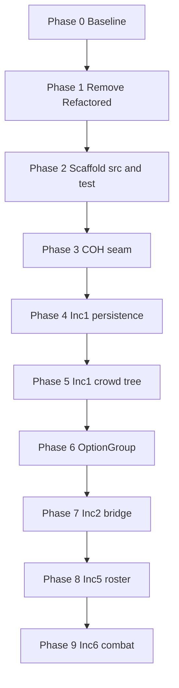

# Hero VTT Refactoring Plan

**Status:** Research / planning — no production refactor started yet  
**Date:** 2026-05-22  
**Scope:** Move `HeroVirtualTabletop.WPF` toward `abd-clean-code`, `hero-vtt-technical-architecture`, and increment object models — test-first from spec-by-example.

---

## 1. Executive summary

The WPF app has strong **spec-by-example** and **E2E** investment, but production code has not caught up:

- **Fat ViewModels** (`RosterExplorerViewModel` ~3,700 lines, `CharacterExplorerViewModel` ~2,600, `AbilityEditorViewModel` ~2,000) hold business logic that belongs in domain classes.
- **No clean domain layer** for roster, crowd tree, combat, etc.
- **COH integration leaks** via static `GameCommandExecution`, direct `new MemoryElement()`, and imports outside `Library/Integration`.
- **Legacy test project** (`Module.UnitTest`) uses old technical folders — **do not migrate**; rewrite from SBE.

**Approach:** Incremental strangler refactor. **Domain tests from SBE first (RED)**, extract domain into `src/{Domain}/`, slim ViewModels, keep E2E green. **No big-bang rewrite.**

---

## 2. Decisions (locked)

| Topic | Decision |
|-------|----------|
| **CrowdTree vs CrowdRepository** | CrowdTree is the display/orchestration surface; it **calls** CrowdRepository for registry and persistence. VM binds to CrowdTree with one-liner commands. |
| **Refactored/ folder** | For a **separate new app** — remove from this repo: `HeroVirtualTabletop.dll`, migrate code, `btMigrate` button, `extern alias HVTRefactored`. |
| **OptionGroup** | Abstract base + `IdentityOptionGroup`, `AbilityOptionGroup`, `MovementOptionGroup` — implement per object model; no approval gate. |
| **Old unit tests** | **Retire `Module.UnitTest`** — do not map or move. New tests written **from scratch** from SBE + story map (ATDD). |
| **Test source of truth** | `docs/increment-N/specification-by-example-*.md` + story map sub-epic names (same as E2E). |
| **Composition root** | `HeroVirtualTabletopModule.RegisterViewsAndRepositories()` — extend Unity registration to wire domain services + COH interfaces, not just View/ViewModel pairs. |

---

## 3. Target architecture

### 3.1 Layers

```
Presentation (View + ViewModel)     ← one-liner commands, direct domain bindings
        ↓
Domain (entities, aggregates)       ← plain C#, constructor-injected seams
        ↓
Integration (COH only)              ← IGameCommandExecutor, IMemoryInstance, IIconInteractionUtility
```

**Rules:**

- ViewModel command handlers ≤ 3 lines; delegate to domain.
- No concrete COH types in domain or ViewModels.
- No static `GameCommandExecution` at new call sites.
- Cross-feature sync via domain observables — not Prism EventAggregator for state.

### 3.2 Mechanisms (hero-vtt-technical-architecture)

| Mechanism | Outcome |
|-----------|---------|
| **Skinny ViewModel** | Commands delegate; properties bind directly to domain |
| **COH Game Bridge Seam** | All COH concrete types in `src/Integration/` only |
| **Direct Memory Manipulation** | Offsets only in `MemoryInstance`; domain uses semantic `IMemoryInstance` |
| **OptionGroup** | Typed subclasses with selection/active invariants in domain |

---

## 4. Repository layout

### 4.1 Production — `src/` by domain

Organize by **domain aggregate**, not by layer. Co-locate domain class + ViewModel + View in the same domain folder.

```
src/
  Shell/                              ← app entry, module bootstrap
  Integration/
    GameCommunicator/                 ← IGameCommandExecutor, HookCostumeGameCommandExecutor
    ProcessCommunicator/              ← IMemoryInstance, MemoryInstance
    Utility/                          ← IconInteractionUtility, DllInjector (no business rules)

  ApplicationShell/
  Crowds/
    CrowdTree.cs
    CrowdRepository.cs
    Crowd.cs
    CrowdMember.cs
    Clipboard.cs
    CharacterExplorerViewModel.cs
    CharacterExplorerView.xaml
  Character/
    Character.cs
    CharacterEditorViewModel.cs
    CharacterEditorView.xaml
  OptionGroups/
    OptionGroup.cs                    ← abstract base
  Identities/
    IdentityOptionGroup.cs
    Identity.cs
    ...
  AnimatedAbilities/
    AbilityOptionGroup.cs
    AnimatedAbility.cs
    ...
  Movements/
    MovementOptionGroup.cs
    CharacterMovement.cs
    MovementExecution.cs
    ...
  Roster/
    Roster.cs
    RosterEntry.cs
    ActiveCharacter.cs
    GangMode.cs
    RosterExplorerViewModel.cs
    RosterExplorerView.xaml
  Desktop/
  Combat/
  CrowdMove/
  HCSIntegration/
  CameraRig/
  GameBridge/
```

**Note:** `src/` domain names (Crowds, Roster) intentionally differ from test sub-epic names (manage_crowd_repository, roster) — see §5.

### 4.2 Tests — `test/` by story map (from scratch)

**Do not migrate `Module.UnitTest/`.** Write every domain test from SBE scenarios.

Same sub-epic / story / scenario hierarchy as E2E. Domain tests call production domain API with fakes; E2E calls FlaUI.

```
test/
  Support/
    FakeMemoryInstance.cs
    NoOpGameCommandExecutor.cs
    GameCommandTestAssemblyHooks.cs

  manage_crowd_repository/
    ManageCrowdRepositoryHelper.cs
    load_active_crowd_files_on_startup/
      LoadActiveCrowdFilesOnStartup.cs       ← [TestClass] = story name
    browse_and_activate_crowd_files/
      BrowseAndActivateCrowdFiles.cs
    save_dirty_crowds_to_source_files/
      SaveDirtyCrowdsToSourceFiles.cs
    save_crowd_to_new_file/
      SaveCrowdToNewFile.cs

  roster/
    RosterHelper.cs
    spawn_character_to_desktop_from_roster/
      SpawnCharacterToDesktopFromRoster.cs
    ...

  animated_ability_management/
    create_animated_ability/
      CreateAnimatedAbility.cs
    ...

  e2e/                                    ← Tier 3 — same tree, FlaUI (move from tests/e2e/)
    manage_crowd_repository/
      load_active_crowd_files_on_startup/
        LoadActiveCrowdFilesOnStartup.cs
    roster/
      ...
    Support/
      AppDriver.cs
```

### 4.3 ATDD structure rules

Before writing any test file, declare:

```
Story path:  [Sub-Epic] → [Story]
File:        test/{sub_epic}/{story_snake}/{StoryPascal}.cs
Class:       {StoryPascal}                    ← exact story name from SBE
Method:      {ScenarioOutcomePascalCase}      ← exact scenario title from SBE
```

**Per test method:** orchestrator pattern — `# Given` / `# When` / `# Then` comments; helpers `given_*`, `when_*`, `then_*`.

**Workflow per story:**

1. Read SBE scenario in `docs/increment-N/`.
2. Write domain test — **RED**.
3. Implement domain in `src/{Domain}/` — **GREEN**.
4. Optional Tier-2 (VM binding) in same story folder.
5. E2E under `test/e2e/...` stays green.
6. Ignore legacy `Module.UnitTest` until project deleted.

### 4.4 Example domain test (target shape)

```csharp
[TestClass]
public class LoadActiveCrowdFilesOnStartup : ManageCrowdRepositoryHelper
{
    // Scenario: An empty Active Crowd List loads no Crowds and no defaults
    [TestMethod]
    public void EmptyActiveCrowdListLoadsNoCrowdsAndNoDefaults()
    {
        // Given: the Active Crowd List is empty
        GivenActiveCrowdListIsEmpty();

        // When: Crowd Tree loads active files on open
        WhenCrowdTreeLoadsActiveFilesOnOpen();

        // Then: no crowds are registered
        ThenCrowdRepositoryHasNoCrowds();
        ThenNoCrowdLoadErrorsOccurred();
    }
}
```

E2E uses the **same class and method names**; helpers drive UI instead of domain.

---

## 5. src vs test naming

| | Organized by | Example |
|--|--------------|---------|
| **`src/`** | Domain aggregate (object model) | `src/Crowds/CrowdTree.cs` |
| **`test/`** | Story-map sub-epic (SBE + E2E) | `test/manage_crowd_repository/...` |

This is intentional. Production groups by **what things are**. Tests group by **what behavior the spec describes**.

---

## 6. Current state (baseline)

### 6.1 Fat ViewModels (priority debt)

| ViewModel | ~Lines | Debt |
|-----------|-------:|------|
| `RosterExplorerViewModel` | 3,701 | Roster, desktop, combat, HCS, crowd move |
| `CharacterExplorerViewModel` | 2,622 | Crowd tree, clipboard, load/save, filter |
| `AbilityEditorViewModel` | 2,040 | Ability editing orchestration |
| `OptionGroupViewModel` | 973 | Selection semantics (partially extracted) |

Also remove: duplicate `RosterExplorerViewModel - Copy.cs`, `Rosters/Class1.cs`.

### 6.2 Architecture violations

- Missing `Roster` domain aggregate.
- Static `GameCommandExecution` + direct `new MemoryElement()` in domain/VM.
- `CrowdMember : Character` (model says compose, not inherit).
- `Helper.cs` cross-cutting globals.
- `Module.UnitTest` mixed tiers; `tests/domain/` empty.
- No `Module.IntegrationTest` for Game Bridge.

### 6.3 Object model inputs

| Increment | Docs | Code gap |
|-----------|------|----------|
| 1 | `object-model-increment-1.md` + SBE | CrowdTree/Repository logic in VM |
| 2–6 | CRC + SBE (no typed OM yet) | Logic on `Character` god-object and roster VM |

Resolve CRC doc duplicates before large extractions: **F2** (Tree vs Repository wording — behavior is Tree orchestrates, Repository persists), **F4** (OptionGroup base — implement).

### 6.4 Validation tooling

- `abd-clean-code` has **no C# scanners** — manual rules pass only.
- Consider adding hero-vtt architecture scanners later (VM line count, COH import ban).

---

## 7. Phased roadmap

### Phase 0 — Baseline (S)

- Run `Module.UnitTest` suite; record pass/fail.
- Run E2E subset / full pass per `tests/e2e/RESUME-STATUS.md`.
- Inventory VM LOC and COH import graph.
- **DoD:** Baseline report; no production changes.

### Phase 1 — Cleanup dead experiments (S)

- Remove `Refactored/` references: migrate code, `btMigrate`, `HVTRefactored` alias, unused `Caliburn.Micro` ref in module csproj.
- Delete duplicate Copy VMs and `Class1.cs` when safe.
- **DoD:** Builds clean; no behavior change for normal GM workflows.

### Phase 2 — Scaffold `src/` + `test/` (S)

- Create `src/` domain folders and `test/` story-map folders.
- Add `test/Support/` fakes + assembly hooks.
- New test project(s): domain tests + keep E2E project (relocate to `test/e2e/` when ready).
- **DoD:** One story wired end-to-end in new layout (empty or RED test compiles).

### Phase 3 — COH seam hardening (M)

- Assembly-level `FakeMemoryInstance` + `NoOpGameCommandExecutor`.
- Constructor injection on new/changed domain paths.
- Ban new static `GameCommandExecution` usages.
- Create `test/integration/` (or separate csproj) for Game Bridge tests.
- **DoD:** Fakes wired; no new static executor call sites.

### Phase 4 — Increment 1: Crowd persistence (L)

**Stories (from SBE):** Load Active Crowd Files on Startup, Browse and Activate, Save Dirty, Save to New File, Daily Backup.

- Write domain tests from SBE under `test/manage_crowd_repository/...` — **RED**.
- Implement `CrowdTree` + `CrowdRepository` in `src/Crowds/`.
- Slim `CharacterExplorerViewModel` save/browse to one-liners.
- **DoD:** Inc 1 persistence domain tests green; E2E `manage_crowd_repository/*` green.

### Phase 5 — Increment 1: Character & crowd tree (L)

**Stories:** add/rename/clone/link/nest/filter, clipboard, All Characters crowd.

- Domain tests from SBE — RED first.
- Fix `CrowdMember` composition; move invariants off VM.
- **DoD:** Crowd tree CRUD in domain; VM interim < 1,500 lines.

### Phase 6 — OptionGroup pattern (M)

- `OptionGroup` abstract base + three typed subclasses in `src/OptionGroups/` and domain folders.
- Domain tests from identity/ability/movement SBE.
- Slim `OptionGroupViewModel` < 200 lines.

### Phase 7 — Increment 2: Game bridge & identity (M)

- `GameBridge` facade; extract spawn/ghost from `Character`.
- Domain tests from `game_bridge_initialization`, `identity_management` SBE.

### Phase 8 — Increment 5: Roster & desktop (L)

- `Roster`, `RosterEntry`, `ActiveCharacter`, `GangMode` in `src/Roster/`.
- Domain tests from `test/roster/`, `test/desktop_overlay/`, `test/context_menu/` SBE.
- Replace EventAggregator roster sync with domain subscriptions.

### Phase 9 — Increment 6: Combat & orchestration (L)

- Extract `CombatExecution`, `CrowdMove`, `CombatGeometry`; split `HCSIntegrator`.
- Domain tests from combat/crowd_move/hcs SBE sub-epics.
- **DoD:** `RosterExplorerViewModel` < 300 lines or split into domain-bound feature VMs.



**Parallelization:** Phase 1 + 2 can overlap Phase 0. Phase 6 after Phase 5 Character entity exists.

---

## 8. Composition root (plain language)

**Composition root** = where the app **wires objects together at startup**.

When the UI needs a `CharacterExplorerViewModel`, something must supply a `CrowdTree`, `CrowdRepository`, and COH fakes/reals. That wiring lives in:

`HeroVirtualTabletopModule.RegisterViewsAndRepositories()`

Today it only registers View + ViewModel. After refactor it also registers:

- `IGameCommandExecutor` → real or `NoOp` (tests)
- `IMemoryInstance` → real or `FakeMemoryInstance` (tests)
- `CrowdRepository`, `CrowdTree`, `Roster`, etc.

No new concept — **extend the existing Unity module registration**.

---

## 9. Do not do

| Anti-pattern | Why |
|--------------|-----|
| Big-bang rewrite of god ViewModels | Unmergeable PRs; E2E blackout |
| Migrate `Module.UnitTest` files | Wrong structure; write from SBE instead |
| Split VMs that talk via EventAggregator | Recreates fat-VM problem |
| Rename E2E story folders | Breaks traceability |
| Delete failing E2E to “fix” refactor | Fix production or AppDriver |
| Extract domain before COH injection | Domain will still call COH directly |
| Keep `HVTRefactored` / `Refactored/` | Separate new app; not this codebase |
| Gate CI on live Game Bridge tests | Requires COH install |

---

## 10. Success criteria

### Program complete

- ViewModels < 300 lines (or documented exception with plan).
- Zero domain/VM imports of concrete COH types outside `src/Integration/`.
- Domain tests cover every SBE story per increment (from `test/`).
- E2E suite green under `test/e2e/`.
- `Module.UnitTest` deleted.
- `Refactored/` removed.

### Per-phase

- Domain tests for extracted behavior: RED → GREEN.
- Affected E2E subset green.
- Measurable VM LOC reduction in target file.

---

## 11. Per-PR checklist

- [ ] SBE scenarios identified for behavior in scope
- [ ] Domain tests written **before** extraction (RED → GREEN)
- [ ] No new concrete COH imports in domain/VM
- [ ] VM command handlers ≤ 3 lines for touched commands
- [ ] E2E subset run green
- [ ] Legacy `Module.UnitTest` untouched (until story fully replaced)

---

## 12. References

| Artifact | Path |
|----------|------|
| Architecture reference | `.cursor/skills/hero-vtt-technical-architecture/inputs/architecture-reference.md` |
| Increment 1 object model | `docs/increment-1/object-model-increment-1.md` |
| Increment 1 SBE | `docs/increment-1/specification-by-example-increment-1.md` |
| CRC cross-review | `docs/cross-increment-crc-review.md` |
| E2E tests (current) | `tests/e2e/` |
| Legacy unit tests (retire) | `HerovirtualTableTop/.../Module.UnitTest/` |
| Skinny MVVM example | `Module.UnitTest/ArchitectureExample/SkinnyViewModelExample.cs` |
| ATDD skill | `.cursor/skills/abd-acceptance-test-driven-development/SKILL.md` |

---

## 13. Suggested first PR

**Phase 1 — Remove Refactored experiment**

1. Delete migrate region + `MigrateRepositoryCommand` + `btMigrate` button.
2. Remove `HeroVirtualTabletop.dll` reference and `extern alias HVTRefactored`.
3. Remove unused `Refactored/Caliburn.Micro.dll` reference from module csproj.
4. Run build + existing tests.

No GM-facing behavior change unless someone used the Migrate button.

**Phase 2 first story — Load Active Crowd Files on Startup**

1. Create `test/manage_crowd_repository/load_active_crowd_files_on_startup/LoadActiveCrowdFilesOnStartup.cs` from SBE.
2. Create `src/Crowds/CrowdTree.cs` + `CrowdRepository.cs` stubs to drive RED → GREEN.
3. Keep E2E green.
